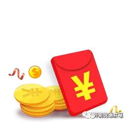

<!--
author: 涛涛
head: http://pingodata.qiniudn.com/jockchou-avatar.jpg
date: 2017-12-01
title: 【外卖优惠共享】运营原理
tags: 外卖,饿了么,美团,手气红包
status: publish
summary: 介绍公众号【外卖优惠共享】运营原理，让大家更好的相信我们能努力在为大家提供更好的手气红包服务
【外卖,饿了么,美团,手气红包】
-->

玩转外卖【手气红包】

## 目的

>【饿了么】【美团】外卖越来越贵，红包金额越来越低,所以本程序员有点承受不起外卖的高价，再有些时候想要领取红包的时候，因为手头没有大红包导致觉得性价比不高,所以运营本公众号。

## 意义
* [饿了么],[美团]实行手气红包,我们的目的是让用户一天内60%的概率领取到手气红包
* 充分利用每个人的5次机会,来帮助别人领取到手气红包

## 原理

> ❈ 分配红包的时候剔除领取次数大于【手气红包】的红包。
  >>  举例：【饿了么】一个分享红包可以领取10次，【手气红包】是5，其后面5次，肯定没有大红包。所以本公众号记录领取次数，在【记录领取次数】大于【手气红包】的时候，本公众号就剔除分配。
  
>  ❈ 尽力分配【手气红包】
  >> 举例：  现有一个分享红包 其【手气红包】为5，我们记录到领取为4的时候，此时下个红包被定义为【手气红包】，所以我们会尽最大努力每天分配一个【手气红包】给您，这个也是本公众号宣传的获取【手气红包】概率为60%的原因。

