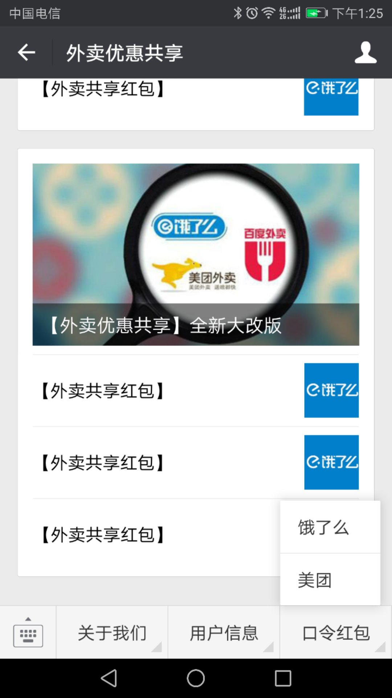
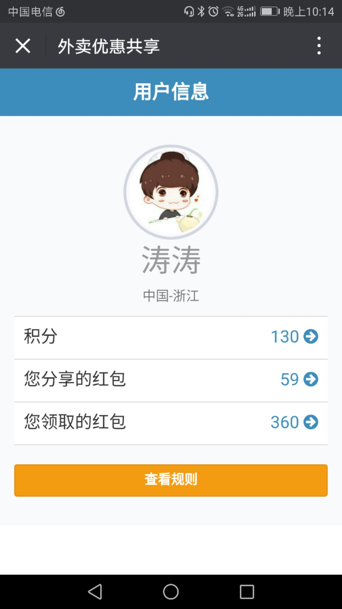

<!--
author: 涛涛
head: http://pingodata.qiniudn.com/jockchou-avatar.jpg
date: 2017-12-02
title: 【外卖优惠共享】全新改版
tags: 外卖,饿了么,美团,手气红包群
status: publish
summary: 介绍公众号【外卖优惠共享】改版内容，让大家更好的相信我们能努力在为大家提供更好的手气红包服务
-->

感谢大家对公众号[外卖优惠共享]的关注和使用,这大半个月的试运行,用户量已经超过了200+，每天的使用人数40+。
特此:谢谢大家
> 本公众号宗旨是为大家提供更多更好的优惠服务.如果用的开心的话，麻烦帮忙转载一下

## 流程优化

> ### 修改前
  * 【发一返四】的操作,超级麻烦。因为订餐流程是先订餐,再分享【红包】。
  *  发红包才能领【红包】,这个给大家造成了很多麻烦。

> ### 修改后
 *  追加【口令红包】按钮，轻松点点，就立马获取红包。
 *  追加【红包领取】页面，可以轻松查看可领红包列表，给用户更好的用户体验

## 积分功能
> 半个月中试运行了一段时间的口令领红包,体验的效果非常好，但是反馈回来的红包比较少。为了公众号的长久运营，追加积分功能。
以下针对积分增减的说明: (口令1次=3个红包)
（分享红包送3个红包）
 *  关注公众号（+40）
 *  分享饿了么优惠券（+20）[ 2次/天] 
 *  分享美团优惠券（+20）[ 2次/天] 
 *  饿了么口令领卷（-20 ）[ 2次/天] 
 *  美团口令领卷（-20）[ 2次/天]                      

## 红包质量提升

> 因为之前流程的问题,导致红包质量不高，特此我和我的几个朋友
，通过对大家上传的红包进行筛选，把有效的红包发给大家。
因为为了长久的运维，希望大家把分享的红包分享给自己，以后再发到公众号。
特此，谢谢大家了。
请大家再相信我们一个月，低质量有可能还会延续几天,接下去一个我会重点
把红包质量提高方面努力。

## UI界面

